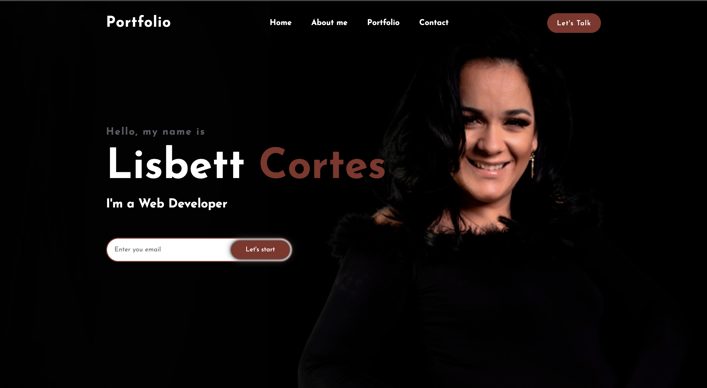
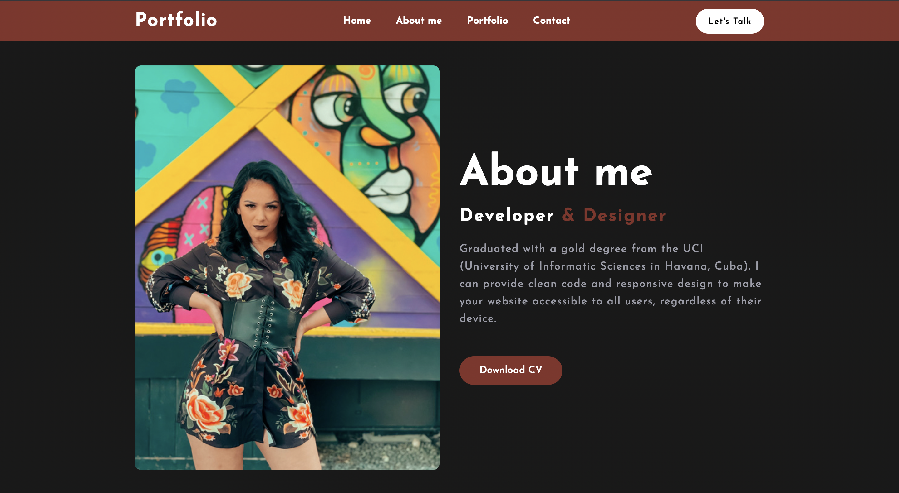
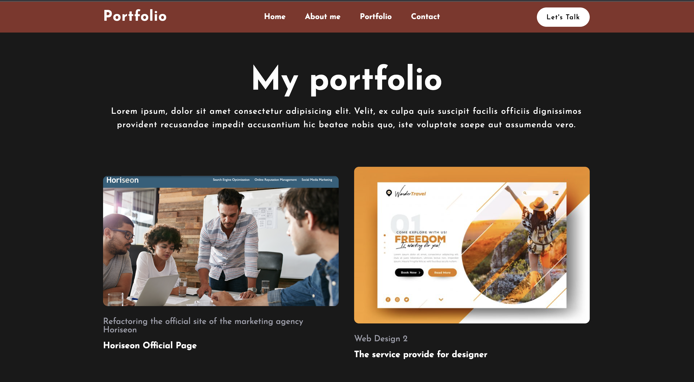
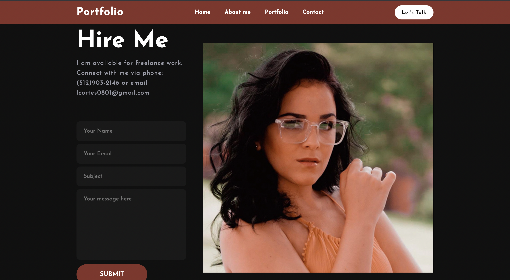

# MY PORTFOLIO

## DESCRIPTION
As a software developer I understand the importance of having a portfolio at a professional level. 
That is why the motivation arises to carry out this project to show the client the services that can be provided 
and use the portfolio as a "cover letter" for future contracts.

## Table of Contents
- [HOME](#home_page)
- [ABOUT ME](#about_me)
- [PORTFOLIO](#portfolio)
- [CONTACT ME](#contact)

## home_page

It constitutes the main section of the page, a brief presentation that also contains a space for subscription (such as a "newsletter") where the user can sign up using their email and can receive all future notifications such as new services, prices, offers , etc.

## about_me

A more descriptive space, but concise. A bit of my history, where I come from and the possibility that the user can download a more complete CV.

## portfolio

One of the most important spaces of this project is the "Portfolio" section where some of the work carried out is shown, with an image and a brief description of each project. When clicking on the image of the project of interest, the user is redirected to the deployed page

## contact

A space to establish communication with the client, you can enter your data and your specific questions to be answered as soon as possible

